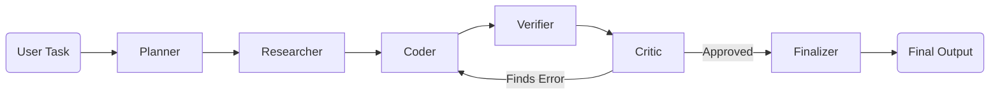

<div align="center">
  
# 🤖✨ VersatileAI

**A High-Performance Multi-Agent Verification Engine**

[](#)
[](#)
[](#)
[](#)
[](#)

[Live Demo](https://versatile-ai-delta.vercel.app/) 

</div>

---

## 📸 Dashboard


## 🌟 Overview

**VersatileAI** is an advanced multi-agent orchestration platform designed to solve complex tasks while ensuring maximum accuracy. Instead of relying on a single AI model to generate and verify its own work, VersatileAI coordinates a swarm of specialized agents. 

Every output goes through a strict pipeline: **Plan ➡️ Research ➡️ Draft ➡️ Verify ➡️ Critique ➡️ Finalize**, ensuring zero hallucinations and purely evidence-backed reasoning.

---

## 🧠 Multi-Agent Architecture

We built a custom state-machine in Python to route tasks through specialized agents without the overhead of heavy frameworks. 



### Agent Responsibilities:
1. 🗺️ **Planner**: Instantly breaks down the user prompt into manageable, logical steps.
2. 🔬 **Researcher**: Gathers specific, factual evidence before any drafting begins.
3. ✍️ **Coder (Writer)**: Takes the research data and writes a fully structured draft.
4. 🔍 **Verifier**: A strict fact-checker that scans the draft for potential errors.
5. ⚖️ **Critic**: Evaluates the text for logic flaws or hallucinations. Rejects and sends back to the Coder if errors are found!
6. ✅ **Finalizer**: Formats and delivers the verified markdown to the frontend.

---

## 🚀 Running Locally

Want to run the Multi-Agent Engine on your own machine? Follow these steps:

### 1. Backend (Python/Flask)
The backend powers the agent swarm using high-speed open-source models via Groq/OpenRouter.
```bash
cd backend
pip install -r requirements.txt
```
*Create a `.env` file inside the `backend` folder containing your API keys (e.g., `GROQ_API_KEY`).*
```bash
python main.py
```
*The API will start running on `http://localhost:8000`.*

### 2. Frontend (Next.js)
The frontend provides a beautiful interface with real-time agent logging.
```bash
cd frontend
npm install
npm run dev
```
*Visit `http://localhost:3000` to see the app in action!*

---
<div align="center">
Built for HackFusion 2026 🚀
</div>
